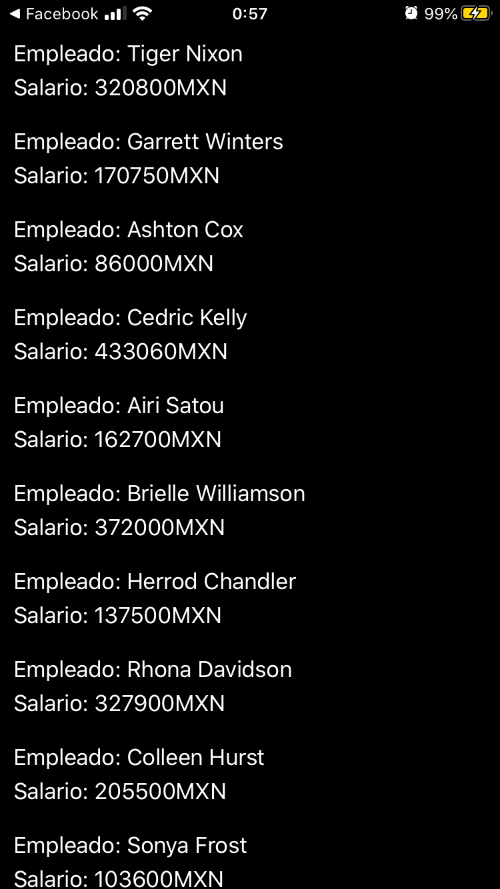

# API-Generica
Proyecto creado por: Manuel Soberanis Mis, para la asignatura de Programacion de Moviles. 
Impartida por el profesor: Jorge Alfredo Colli Chi.

En este proyecto se muestra el uso de una API generica en Swift(ios)

